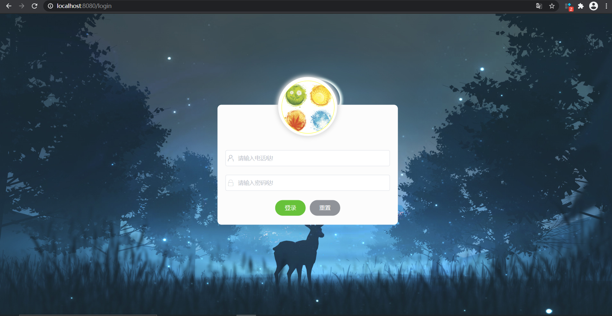

## Web音乐播放器介绍

### 项目说明

1）服务器端：采用Node.js搭建的服务器，解决了同源政策的限制；通过在服务器端访问网易云音乐官方路由(axios方法)来获取数据。

其中，服务器端源代码Github地址：https://github.com/Binaryify/NeteaseCloudMusicApi

网易云音乐Node.js版API**操作文档**地址：https://binaryify.github.io/NeteaseCloudMusicApi/#/

2）客户端：采用Vue+element.js+VueRouter+axios+vuex等技术栈，完成Web音乐播放器的各项功能实现

### 部分效果图



### 项目开发心得

网页音乐平台，本人自学前端时间也不算太久,能坚持做出成果来我还是挺有自豪感的。当然在搭建的时候遇到的问题也非常多,基本上都是自己百度解决；不过接口文档上的接口非常多，功能非常丰富；我也没有把功能全部实现，某些地方也存在小bug，后续有时间会继续更新功能和修复bug。

### 安装教程

```
1. 克隆仓库 
git clone https://github.com/SeKidayo/vue_music.git
2. 下载第三方依赖
npm install
3. 开发环境运行
npm run serve
```

### 特点

1. 使用vue、vuerouter、vuex和element-ui实现
2. 样式大多是纯CSS，flex、float和定位都有用到
3. 接口的请求做了一定的封装，方便重复使用
4. 在搭建页面的时候也学习了预加载、懒加载之类的优化方案；使得页面体验显著提升

### 不足之处

1. 由于是一个人独立开发，页面的整体结构搭配的不是特别好
2. 有些组件封装的不是很好，耦合度还是很高，复用性太差
3. 开发流程不清晰，开发过程中经常各处修补，十分繁琐。